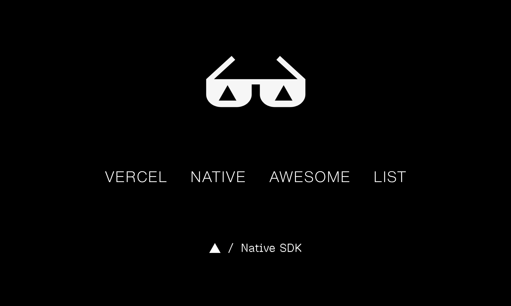

  

  

> A community-curated collection of apps, examples, themes, and tools built with Native SDK, an open-source project from [Vercel Labs](https://github.com/vercel-labs).

[Native SDK](https://native-sdk.dev) is Vercel's open-source toolkit for building fast, lightweight desktop apps with Zig, native-rendered interfaces, GPU surfaces, WebViews, automation, cross-platform packaging, and an `app.zon` manifest.

## Contents

- [Official](#official)
- [Libraries & Packages](#libraries--packages)
- [Framework Integrations](#framework-integrations)
- [Apps](#apps)
- [Examples](#examples)
- [Skills](#skills)
- [Theme Packs](#theme-packs)
- [Tooling](#tooling)

## Official

- [Native SDK](https://github.com/vercel-labs/native#readme) - Source repository for the Vercel Labs Native SDK.
- [Philosophy](https://native-sdk.dev/introduction) - Design principles behind Native SDK's native rendering, explicit state model, simple authoring, customizable defaults, and agent-driven workflows.
- [Quick Start](https://native-sdk.dev/quick-start) - Install the CLI, create an app, run it locally, and build it.

## Libraries & Packages

- [Component Catalog](https://native-sdk.dev/components) - Official native-rendered component catalog with Native markup, TypeScript and Zig examples, builder equivalents, generated attribute references, and engine-rendered previews.
- [Native SDK Package](https://native-sdk.dev/packages) - NPM package and CLI distribution for the SDK.

## Framework Integrations

- [Frontend Integration](https://native-sdk.dev/frontend) - Use existing web frontends in Native SDK apps.
- [Next.js Example](https://github.com/vercel-labs/native/tree/main/examples/next#readme) - Native SDK shell around a Next.js frontend.
- [React Example](https://github.com/vercel-labs/native/tree/main/examples/react#readme) - Native SDK shell around a React frontend.
- [Svelte Example](https://github.com/vercel-labs/native/tree/main/examples/svelte#readme) - Native SDK shell around a Svelte frontend.
- [Vite Integration](https://github.com/vercel-labs/native/pull/98) - Native SDK shell for an existing Vite project, with frontend configuration, environment-based source selection, and development origin setup.
- [Vue Example](https://github.com/vercel-labs/native/tree/main/examples/vue#readme) - Native SDK shell around a Vue frontend.
- [WebViews](https://native-sdk.dev/webviews) - Embed and compose WebView surfaces alongside native UI.

## Apps

- [Audiobook Maker](https://github.com/lichen0114/audiobook-maker/tree/main/desktop#readme) - Native macOS audiobook generation app for a Kokoro TTS backend using Native SDK markup, Zig state, native file picking, and bundled Python, MLX, FFmpeg, and espeak runtime dependencies.
- [Chutes E2EE Native SDK Proof](https://github.com/alex-drocks/chutes-e2ee-chat-nativesdk#readme) - Native-rendered proof app for encrypted Chutes.ai chat requests using Zig, Native markup, `fx.fetch`, and Native SDK automation.
- [Compressor](https://github.com/sonnylazuardi/compressor#readme) - Native Windows image compressor using Native markup, Zig state, native file dialogs, drag and drop, and Bun-powered WebP encoding.
- [GIFBin](https://github.com/henryoman/gifbin#readme) - Native GIF creation app using a Native SDK GPU surface, canvas widgets, Zig state, drag and drop, native dialogs, image decoding, and GIF export.
- [Maat](https://github.com/lzitser23/maat#readme) - Local-first macOS and Windows visual asset manager using Native SDK, Zig, React, SQLite, native file operations, and a system WebView.
- [Mac Cleaner](https://github.com/jellydn/mac-cleaner#readme) - Native macOS cleaner dashboard using Native SDK markup and Zig to run Mole status, cleanup, optimization, purge, and history commands.
- [Mousemove](https://github.com/wjx/mousemove#readme) - Native Windows mouse activity utility using Native SDK canvas rendering, raw input handling, background timers, and a click-through desktop overlay.
- [OCPP DebugKit Studio](https://github.com/ocpp-debugkit/studio#readme) - Early-stage native OCPP charging-session debugger built with Zig and Native SDK, with macOS/Linux CI and automation-driven smoke testing.
- [OfficeMachine Music](https://github.com/brianrabil/officemachine/tree/main/apps/music-player#readme) - Local-first macOS music player rendered entirely with Native SDK, with album browsing, search, native menus, cover art, playback controls, and a persistent queue.
- [OfficeMachine Video](https://github.com/brianrabil/officemachine/tree/main/apps/video-editor#readme) - Local-first video editor using Native SDK, React, Remotion, native project files, local media storage, and an optional AI editing agent.
- [Press](https://github.com/Lulzx/press#readme) - Native macOS video compressor using Native SDK, Zig, drag and drop, file dialogs, live FFmpeg progress, and quality presets.
- [Project Orbit](https://github.com/Tarachand-Gupta/project-orbit#readme) - AI sandbox game shipping a macOS and Linux desktop shell built with Native SDK, a system WebView, and a Zig bridge.
- [Signet](https://github.com/zig-nostr/signet#readme) - Native macOS Nostr signer using a Native SDK and Zig approval interface for NIP-46 requests handled by an isolated daemon.
- [SkillManager](https://github.com/TudorAndrei/SkillManager#readme) - macOS and Linux agent-skill manager using Native SDK, Zig bridge commands, and a React WebView to discover, install, update, and remove skills.
- [Token Tach](https://github.com/phall1/token-tach#readme) - Native macOS menu bar app for AI coding-agent token usage using Native SDK, Zig, Metal rendering, local ledger tailing, and a vendored Native SDK fork for popover and status-item support.
- [Widgoal](https://github.com/eyadhammouda/widgoal#readme) - Native macOS football score widget using Native SDK native views, a Metal GPU surface, ESPN score data, league and team following, and live menu bar updates.

## Examples

- [AI Chat (TypeScript)](https://github.com/vercel-labs/native/tree/main/examples/ai-chat-ts#readme) - Official zero-Zig example using a TypeScript app core, Native markup, an OpenAI-compatible fetch effect, environment-supplied configuration, and deterministic record and replay.
- [Calculator](https://github.com/vercel-labs/native/tree/main/examples/calculator#readme) - Small native UI app with markup, keyboard input, chrome shortcuts, and theming.
- [Canvas Preview](https://github.com/vercel-labs/native/tree/main/examples/canvas-preview#readme) - Mixed native canvas and WebView panes in one window.
- [GPU Dashboard](https://github.com/vercel-labs/native/tree/main/examples/gpu-dashboard#readme) - Dense native dashboard UI with GPU-rendered widgets.
- [Hello Native](https://github.com/qiuzhanghua/hello-native#readme) - Focused native-rendered counter example using Native SDK markup, a Zig model and update loop, GPU surfaces, hot reload, and UI tests.
- [Notes](https://github.com/vercel-labs/native/tree/main/examples/notes#readme) - Persistence example with effects, restore on boot, dialogs, and search.
- [Official Examples](https://github.com/vercel-labs/native/tree/main/examples#readme) - Native SDK examples covering native UI, WebViews, framework shells, GPU surfaces, mobile embedding, and platform capabilities.
- [Soundboard](https://github.com/vercel-labs/native/tree/main/examples/soundboard#readme) - Native media-style interface with cover art, context menus, timers, and custom theming.
- [Split Collapse](https://github.com/vercel-labs/native/tree/main/examples/split-collapse#readme) - Official native-rendered example comparing runtime, markup-declared, and manual pane-collapse animation while measuring frame pacing and optional WebView reflow.
- [∅M〇ᶻ Native Biu Demo](https://github.com/mindon/native-biu-demo#readme) - Minimal zero-config Native SDK demo using `.native` markup, Zig state, hot reload, testing, and the Biu/Bun ecosystem.

## Skills

- [Native SDK](https://github.com/vercel-labs/native/blob/main/skills/native-sdk/SKILL.md) - Official installable skill that teaches coding agents to discover and load version-matched Native SDK guidance from the CLI.

## Theme Packs

- [Theme Gallery](https://nativesdkthemes.vercel.app) - Browsable gallery of Native SDK theme packs.
- [Theme Pack Spec](https://github.com/henryoman/awesome-vercel-native/blob/main/themes/SPEC.md) - Proposed Zig theme-pack format that resolves to the same `DesignTokens` shape as the built-in `house` and `geist` packs.
- [House](https://github.com/henryoman/awesome-vercel-native/blob/main/themes/house.zig) - Default monochrome neutral register.
- [Geist](https://github.com/henryoman/awesome-vercel-native/blob/main/themes/geist.zig) - Built-in Geist-inspired register with cool neutrals, blue focus, 6px controls, and a taller control ladder.
- [Cobalt](https://github.com/henryoman/awesome-vercel-native/blob/main/themes/cobalt.zig) - Example blue-accent theme pack extending `house`.
- [Graphite](https://github.com/henryoman/awesome-vercel-native/blob/main/themes/graphite.zig) - Example dense neutral theme pack extending `geist`.
- [Solarized](https://github.com/henryoman/awesome-vercel-native/blob/main/themes/solarized.zig) - Classic low-contrast warm/cyan theme pack.
- [Dracula](https://github.com/henryoman/awesome-vercel-native/blob/main/themes/dracula.zig) - Purple-accent editor theme with bright semantic colors.
- [Gruvbox](https://github.com/henryoman/awesome-vercel-native/blob/main/themes/gruvbox.zig) - Retro warm theme with earthy semantic hues.
- [Nord](https://github.com/henryoman/awesome-vercel-native/blob/main/themes/nord.zig) - Cool arctic theme with blue-gray surfaces.
- [Monokai](https://github.com/henryoman/awesome-vercel-native/blob/main/themes/monokai.zig) - High-energy classic editor palette with green and cyan accents.
- [One Dark](https://github.com/henryoman/awesome-vercel-native/blob/main/themes/one_dark.zig) - Atom-style neutral dark theme with blue accents.
- [Tokyo Night](https://github.com/henryoman/awesome-vercel-native/blob/main/themes/tokyo_night.zig) - Deep blue editor theme with vivid syntax-inspired hues.
- [Catppuccin](https://github.com/henryoman/awesome-vercel-native/blob/main/themes/catppuccin.zig) - Soft pastel theme with Latte/Mocha-style light and dark palettes.
- [Rose Pine](https://github.com/henryoman/awesome-vercel-native/blob/main/themes/rose_pine.zig) - Muted rose and pine palette with soft rounded surfaces.
- [GitHub](https://github.com/henryoman/awesome-vercel-native/blob/main/themes/github.zig) - Familiar GitHub-style light and dark UI palette.

## Tooling

- [Native SDK CLI](https://native-sdk.dev/cli) - Commands for initializing, developing, checking, testing, building, packaging, and automating apps.
- [Native Markup Extension](https://github.com/vercel-labs/native/tree/main/editors/native-markup#readme) - Editor support for `.native` markup.
- [Theme Installer](https://github.com/henryoman/awesome-vercel-native/blob/main/scripts/install-theme.sh) - Small shell installer for copying a theme Zig module into an app-local `themes/` directory.
- [Theme Gallery](https://github.com/henryoman/awesome-vercel-native/tree/main/tools/theme-gallery#readme) - Minimal Svelte gallery for browsing the theme packs in this repository.

## Contributing

Built something with Native SDK? Read the [curation rules](rules.md) and [contribution guide](contributing.md) before opening a pull request, or [suggest a project](https://github.com/henryoman/awesome-vercel-native/issues/new?template=project-suggestion.yml) if you found something that should be reviewed.

  <a href="https://x.com/ctatedev/status/2075016514860650685"><u>Join the conversation</u></a>

